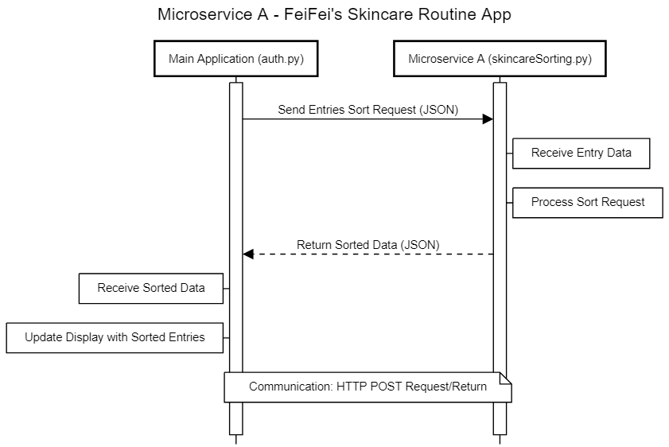

# Skincare

## Microservice A - Skincare Routine Sorting

### Communication Contract

- Main Application (auth.py): While running on http://127.0.0.1:5000/skincare-form, sends the sorting request to the microservice and receives the sorted data. The main application does not perform the sorting itself but prepares and sends the data fetched from the database to the microservice.
- Microservice Form Sorting: The microservice at http://localhost:5001/sort handles sorting based on the provided product name and order request, returning the sorted data in JSON format.

Steps for a User to Make a POST Request
1. Select the Sorting Criteria (Cleanser, Toner, Moisturizer, Serum, Sunscreen)
2. Select the Sorting Order (Ascending, Descending)
3. Click the Submit Button below these two select boxes

### Request/Response Data from Microservice - Breakdown

Main Application (auth.py) - `sort_entries()` function:
1. **Route Handling**: Listens for POST requests at `/sort-entries`.
2. **Data Preparation**: Extracts the sorting criteria from the request, fetches the entries from the database, and prepares them to be sent to the microservice.
3. **Request to Microservice**: Sends a POST request to the microservice at http://localhost:5001/sort, passing the entries and sorting criteria as a JSON file.
4. **Processing the Response**: Receives the sorted entries from the microservice as a JSON file and returns them to the frontend.

Microservice (skincareFormSorting.py) - `sort_entries()` function:
*Note: This file is the Microservice itself. It runs separately from the Skincare App.
1. **Endpoint for Sorting**: Listens for POST requests at `/sort`.
2. **Sorting Logic**: Receives unsorted entries and sorting criteria, sorts the entries based on the criteria, and returns the sorted entries as JSON.

JavaScript `sort_entries()` function in skincare_form.html file:
1. **Triggering the Sort**: Captures sorting criteria (sort by key and order) selected by the user.
2. **Making the POST Request**: Sends criteria entries to the microservice by making a POST request to the endpoint handled by the auth.py route (`/sort-entries`).
3. **Handling the Response**: Updates the HTML to display sorted entries upon receiving the response from the microservice.

### Example Call and Response:

#### Request Data from Microservice - Example Call:
```python
url = 'http://localhost:5001/sort'
data = {
    'sort_key': 'cleanser',  # or 'toner', 'moisturizer', 'serum', 'sunscreen'
    'sort_order': 'asc'  # or 'desc'
}
response = requests.post(url, json=data)
```

#### Request Data from Microservice - Example Response:

```python
sorted_entries = response.json()
```



